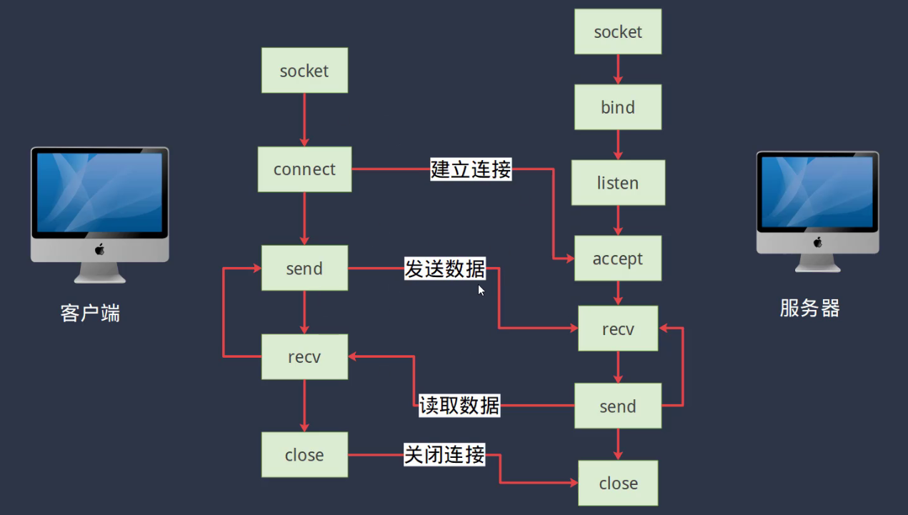

# 数据包收发pcap

---

1. wireshark的基本使用
2. 数据包收发：利用pcap往网络上收发数据包
3. 网络编程：熟悉基本的socket编程、创建一个基于tcp协议的echo服务器、熟悉基本的socket编程接口
4. 熟悉tcpip体系结构，

### 1.pcap库数据包收发

#### 向网络发送数据包

#### 接受数据包

接受数据包修改后，并将数据包进行回发，

