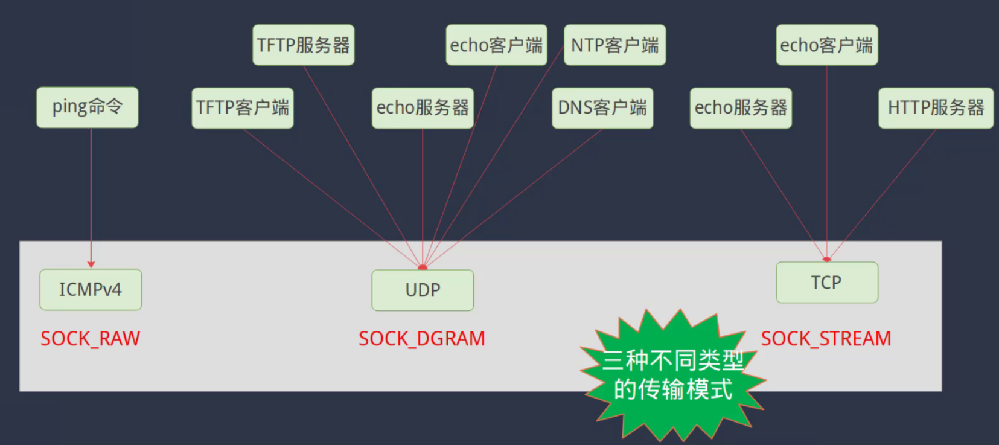
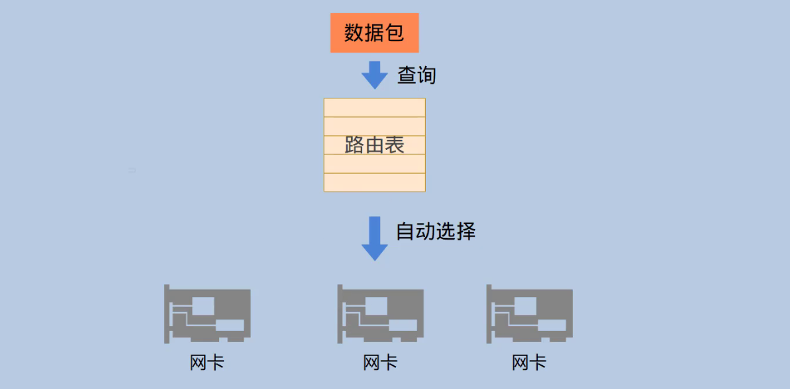
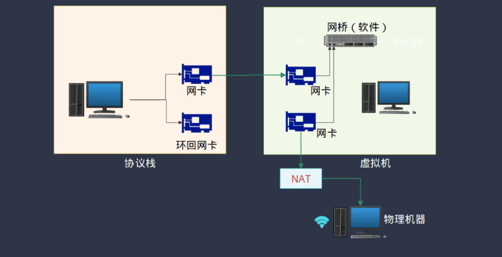
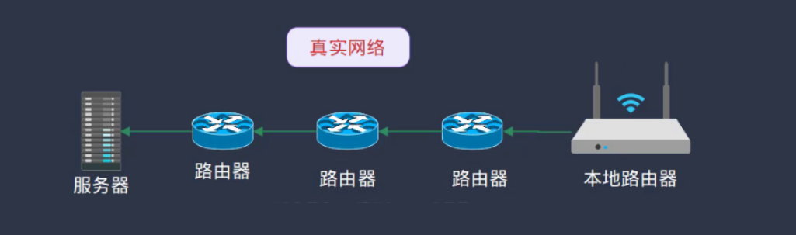

# 核心特性

---

TCP/IP协议栈是操作系统中实现的一种组件，用于让本地计算机与网络上的计算机进行通信交互，

实现一个tcpip协议栈支持主要的协议如下，这是一个通用的软件组件，可以支持移植到不同的操作系统上（x86、ARM）：

- 应用层：tftp、ntp、dns、http
- 传输层：udp、tcp
- 网络层：icmpv4、ipv4、arp
- 物理层：ethernet

该项目支持多网卡并且参考标准socket接口实现，用户在Linux/mac平台上编写的应用代码，可无缝移植到本协议栈上，

- socket、close、listen、accept
- sendto、recvfrom、connect、bind
- send、recv、setsockopt、gethostbyname_r
- inet_ntoa、inet_addr、inet_pton、inet_ntop
- htons、ntohs、htonl、ntohl

协议栈实现顺序思路，

1. 以太网：基本的数据包收发、多网卡的支持
2. IP协议：IP数据包的收发、分片与重组、icmp响应
3. socket：基本socket接口实现、ping命令实现
4. UDP协议：udp数据包的收发、tftp客户端和服务端、dns客户端
5. TCP协议：tcp连接建立和断开、滑动窗口实现、数据重传、http服务器实现

### 1.支持应用协议

同时运行多个应用程序，包括以下3中不同类型的socket传输模式：

1. ping命令（icmpv4、SOCK_RAW）
2. tftp客户/服务端、echo客户/服务端、ntp客户端、dns客户端（udp、SOCK_DGRAW）
3. echo客户端/服务器、http服务器（tcp、SOCK_STREAM）

### 2.tcp协议

tcp协议特性较多，主要实现了以下几个重要的特性

1. 实现tcp状态机
2. 超时重传
3. 动态RTO计算
4. 快速重传
5. 零窗口探测
6. 包活机制等功能

来解决网络传输中出现的：

1. 包丢失
2. 包重复
3. 包乱序
4. 流量控制

通过使用代码来实现协议栈，能够更深层次的理解相关协议（抓包分析协议等方式），更深层次的理解socket接口的使用方法和规则。

#### 数据存储

计算机网卡接收到来自网络的数据包，

针对网络数据包大小不固定的情况，不采用单个超大缓存的方式存储网络数据包，而是采用提升内存效率的链式存储方式进行优化，从而提升存储效率（极大的减少空间的浪费），

#### 协议细节

深入tcpip协议相关细节，对每个协议数据包的格式、通信过程、具体的数据处理，

在深入学习tftp、tcp协议之后，可以学会其中进行可靠传输的基本原理和技术，同时经过大量代码提升编程能力和经验，

### 3.ip协议分片与重组

ip协议会有分片与重组机制，

即对上层应用发来的数据包，会根据底层网卡所能够发送的最大数据包大小，对数据包进行拆分，同时接收端需要重组数据包，

### 4.多网卡路由

针对多网卡实现一个路由表，当有多个网口时根据内置路由表自动选择输出的网口，

路由表可以添加申请路由、实现路由转发功能（简单的路由器）、	

### 5.协议栈测试

借助虚拟机搭建一个局域网环境，在局域网中进行通信测试，

1. 利用npcap库提供的网络数据包收发的接口进行通信，并没有用到本地操作提供的通信接口而是使用自己编写的接口，
2. 自己实现的协议栈中含有通信的代码，另一台主机上也有通信的代码（利用虚拟机模拟），从而进行联合调试，
3. 在调试的过程中使用wireshark软件，进行数据包的抓取并分析，

